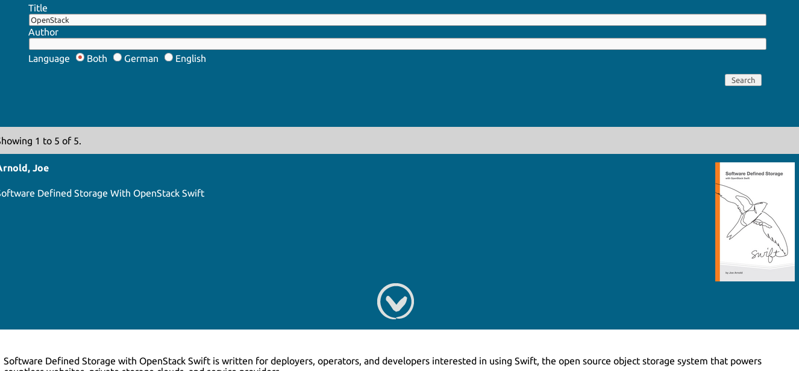

Example for indexing calibre metadata
=====================================

**WARNING: this is only a stub**


I started to import some ebooks into calibre_ and served them via
calibre-server on my raspberry pi. Searching the builtin calibre-index felt
really slow, slow such as waiting up to a few minutes for a result. Also,
accessing the mobi files is slow, since calibre-server does not seem to serve
those files as static assets.


Directory structure of my calibre library::

    Some Author
    |-- Some Title
    |   |-- cover.jpg
    |   |-- Some Title.mobi
    |   |-- metadata.opf
    |-- Some other Title
        |-- cover.jpg
        |-- metadata.opf
        |-- Some other Title.mobi


``metadata.opf`` is the xml, containing the metadata stuff.


However, I thought there must be a faster solution. And because I configured
solr_ yet, I decided to set this up and feed it with calibres metadata.


I took the default solr configuration and just created my own core named
``ebooks``, and added it to ``/etc/solr/solr.xml``::

    <core name="ebooks" instanceDir="/media/data/ebooks/solr" />


In this core directory, I again used an example configuration
``/media/data/ebooks/solr/conf/solrconfig.xml``. And only replaced the data and
updateLog directory::

    <dataDir>/media/data/ebooks/solr/data</dataDir>
    [...]
    <updateLog>
       <str name="dir">/media/data/ebooks/solr/data_updatelog</str>
    </updateLog>


After that, I just had to create a ``/media/data/ebooks/solr/conf/schema.xml``.
And again, only used one of the solr example files and defined some fields like
author::

      <field name="author" type="string" indexed="true"
             stored="true"  multiValued="false" />


In fact, I only used solr example config files with three changed lines. No
changes on any performance or memory parameters.


And it turns out... The index is quite fast, although solr is only running on
the raspberry pi, as well.


Like I mentioned already. This is far from being used in real life, but maybe
will give you an idea who to use solr, combining this with a little python
example. Walking the file system tree, parsing xml files, searching in the xml
result set via xpath, talking to http api using requests_.
(See python-workshop_).


Little webui
````````````

I just added a little webui based on jquery_. This only queries solr for json
results and show author, title, cover and description.

As a requirement, your library must be at::

    $DOCUMENTROOT/books


However, your DOCUMENTROOT should look like this::

    .
    |-- books -> /YOUR/EBOOK/LIBRARY
    |-- css
    |   |-- master.css
    |-- img
    |   |-- next_book.png
    |   |-- next.png
    |   |-- prev_book.png
    |   |-- prev.png
    |   |-- top.png
    |-- index.html
    |-- js
        |-- jquery-2.1.1.min.js


You have to configure your webserver to pass requests to /ebooks directly to
solr. This is how to do it with nginx_::    

    location /ebooks {
        proxy_pass http://localhost:8983/ebooks;
    }


This is what it looks like.




Unfortunately, the buttons with internal references does not work on the
Kindle :/


.. _calibre: http://calibre-ebook.com/
.. _solr: http://lucene.apache.org/solr/
.. _requests: http://docs.python-requests.org/
.. _python-workshop: https://github.com/chrigl/python-workshop
.. _jquery: http://jquery.com/
.. _nginx: http://nginx.org/
